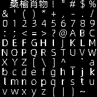

# IotByteFont：.NET点阵字体制作工具

IotByteFont 是一款.NET点阵字体创造工具。它可以加载自己喜欢的字体文件并生成自定义的点阵字体代码。对于需要自定义字体渲染的IoT项目，这个工具特别有用，适用于 .NET nanoFramework。

[English](./readme.md) | 简体中文

## 安装

通过以下命令安装 IotByteFont 工具：

```bash
dotnet tool install -g IotByteFont
```

## 使用

以下是IotByteFont工具的命令行选项：

```
IotByteFont 1.0.0
Copyright (C) 2023 SangSQ

  -f, --font         (Default: Microsoft YaHei UI) Font file path or font name.

  -c, --char         Required. (Default: chars.txt) Char file path or char string.

  -s, --size         (Default: 16) Font size.

  -w, --width        (Default: 0) Font width. 0 means same as font size.

  -y, --yoffset      (Default: 0.75) Font y offset. size * y. Not recommended to adjust. Adjust with debug mode.

  -t, --threshold    (Default: 128) Threshold for binarization.

  -n, --name         (Default: IotByteFont) Output class name.

  -d, --debug        (Default: false) Debug mode. Print debug info and bitmap.

  --help             Display this help screen.

  --version          Display version information.
```

### 一般使用

要创建字体，您需要指定字体文件或字体名称，要包含在字体中的字符，以及字体的大小。

您还可以指定字体的宽度，y偏移量，以及输出类的名称。打开调试模式可以打印调试信息和最终字体的位图。

```bash
IotByteFont --char "abcde" --size 8
IotByteFont --font ms.ttf --char chars.txt --yoffset 0.6 --name MyFont --debug
```

### 特殊使用

因为目前 `nanoFramework.Iot.Device.Ssd13xx` 的限制，字体大小宽度必须是 8 或者 16，所以如果您需要使用其他大小的字体，则需要使用下面的方法显示：

```cs
public static void DarwString(Ssd13xx device, int x, int y, string str, byte size = 1)
{
    int inx = 0;
    int fontWidth = device.Font.Width;
    int fontHeight = device.Font.Height;

    int fontWidthTimesSize = fontWidth * size;
    int fontArea = fontWidth * fontHeight;

    byte[] bitMap = new byte[fontArea];

    foreach (char c in str)
    {
        // 字体数据  device.Font.Width * device.Font.Height 的 16 进制数据
        byte[] charBytes = device.Font[c];

        for (int i = 0; i < charBytes.Length; i++)
        {
            byte b = charBytes[i];
            int baseIndex = i * 8;
            for (int j = 0; j < 8; j++)
            {
                // 获取二进制位
                int bit = (b >> j) & 1;
                // 存储二进制位到位图数组
                bitMap[baseIndex + j] = (byte)bit;
            }
        }

        // 按照字体大小从左到右，从上到下绘制位图
        int baseX = x + fontWidthTimesSize * inx;
        for (int i = 0; i < fontHeight; i++)
        {
            int baseY = y + i * size;
            for (int j = 0; j < fontWidth; j++)
            {
                // 获取二进制位
                int bit = bitMap[i * fontWidth + j];
                // 根据size绘制像素或填充矩形
                if (size == 1)
                {
                    device.DrawPixel(baseX + j * size, baseY, bit == 1);
                }
                else
                {
                    device.DrawFilledRectangle((baseX + j * size), baseY, size, size, bit == 1);
                }
            }
        }
        inx++;
    }
}
```

该函数允许您显示字体宽*高度为8的倍数的任何大小字体，调用方式示例：

```cs
using Ssd1306 device = new Ssd1306(I2cDevice.Create(new I2cConnectionSettings(1, Ssd1306.DefaultI2cAddress)), Ssd13xx.DisplayResolution.OLED128x64);
device.ClearScreen();
device.Font = new IotByteFont();
DarwString(device, 2, 32, "桑榆肖物", 2);
DarwString(device, 0, 0, "IotByteFont", 1);
device.Display();
```

## 预置 chars 和字体推荐

在 data 目录下有一些有用的资源，包含一款字体和几个 chars 文件。

字体这里推荐开源的点阵字体 [unifont](https://unifoundry.com/unifont/index.html) 和目录里的 [阿里巴巴普惠体 45 Light](./data/ph45.ttf)。

## 高级参数和调试

一般我们在 Windows 中只需要一个参数 `-c` 指定 chars 文件即可。 如果不需要调整更多的字体展示效果，那么可以使用下面几个参数：

- `-y` 调整字体的 y 偏移量，默认是字体大小的 0.75 倍，如果字体显示不全，可以调整这个参数。
- `-t` 调整字体的二值化阈值，默认是 128，如果字体图片的二值化显示不清晰，可以调整这个参数。

调整效果时建议打开调试模式，可以使用`--debug`选项启用调试模式。这将打印调试信息和最终字体的位图。



## 贡献

欢迎对IotByteFont进行贡献。请提交拉取请求或在GitHub仓库上创建问题。

## 许可

IotByteFont在MIT许可下授权。有关更多信息，请参阅LICENSE文件。